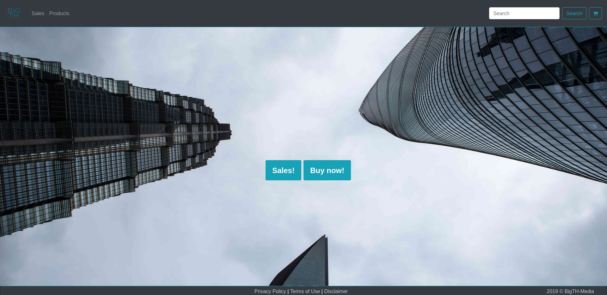

# BigTH-Media

## installation
- `git clone git@github.com:dix0nym/BigTH-Media.git`
- `cd BigTH-Media`
- `npm install`
- `npm start`
- navigate to `localhost:8000`

## lines of code
Language|files|blank|comment|code
:-------|-------:|-------:|-------:|-------:
JavaScript|33|609|126|2912
HTML|14|108|2|787
SQL|1|0|0|596
JSON|2|0|0|553
CSS|1|62|21|209
Python|1|9|2|48
Markdown|1|6|0|23
SUM:|53|794|151|5128

## TODO

all:
- testing

Schmiels
- product/sales toast
- product resolution as "tag"?
- success.html ok?

Cozy-T
- db Sales needs details

dixonym
- ?